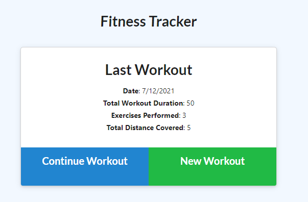
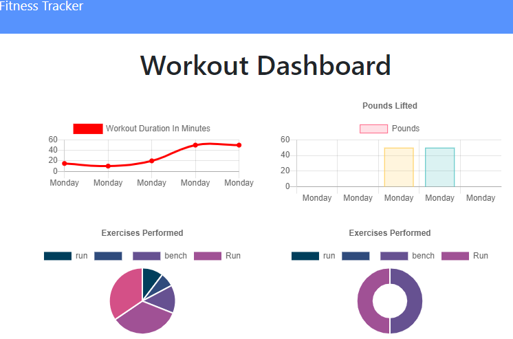

# Fitness-Tracker🏋️‍♀️🏃‍♀️
 

## Description
For this assignment we will be creating a workout tracker. The front end is provided so we will be connecting the backend using MongoDb and Express. 

## User Story
A user wants to be able to create and track their daily workouts. They should be able to log multiple exercises in a day. User should be able to track name of exercise, the type, weights, sets, reps, and duration. For a cardio exercise the user should track distance traveled.

## Acceptance Criteria
- Given when user can add exercises to their most recent workout plan
- Given when user adds the new exercise to a new workout plan
- Given when the user can delete a workout
- Given when dashboard can get workouts from the database
- When user can see the combined weight of multiple exercises for the past seven workouts on stats page

## Tools and Technologies
- Javascript
- MongoDB
- Express
- Heroku

## Usage 
> **To view my application**: visit deployed [Link](https://git.heroku.com/sleepy-forest-97884.git)

## Mockup
()

